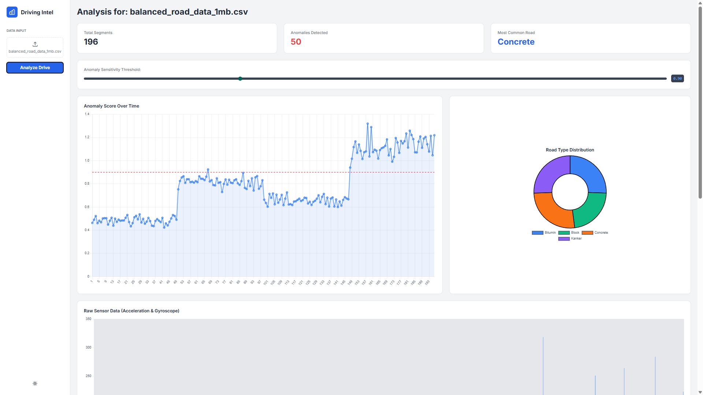
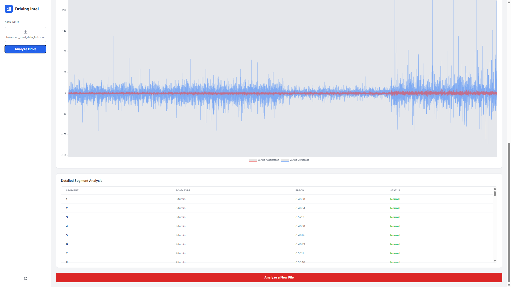

# 🛣️Rash Driving Detector
This project implements a system for detecting rash driving behaviors and identifying road anomalies using accelerometer and gyroscope sensor data. It involves data preprocessing, training machine learning models for road type classification and anomaly detection, and a web application for data upload and visualization of results.

---

## Project Overview
The core idea is to leverage accelerometer and gyroscope data to analyze driving patterns. The project consists of several modular Python scripts and a Flask web application.

**Data Preprocessing**: Raw CSV files containing X_Acc, Y_Acc, Z_Acc (accelerometer) and X_Gyro, Y_Gyro, Z_Gyro (gyroscope) data are processed to extract relevant features and prepare them for model training. This includes handling missing values, normalization, and potentially feature engineering for time-series data.

**Road Type Classification**: A machine learning model is trained to identify different road types (Bitumin, Block, Concrete, Kanker) based on the sensor data collected from vehicles.

**Anomaly Detection**: An autoencoder-based anomaly detection model identifies unusual driving behaviors that deviate from normal patterns.

**Rash Driving Detection**: This module likely combines insights from both road type and anomaly detection, along with predefined thresholds or rules, to flag instances of "rash driving."

**Web Application**: A user-friendly Flask web application provides an interface to upload new sensor data and visualize the results of rash driving and anomaly detection. It loads the pre-trained models to perform real-time (or near real-time) analysis.

 ----

## 📸 Screenshots

### 🟣 Home Page 


### 🧾 Results


### 🧾 Results



---

## 🧠Model Descriptions

This project utilizes two main deep learning models: a Road Type Classifier and an Anomaly Detector, both built using TensorFlow/Keras.

### 1. Road Type Classification Model

The 2_train_road_model.py script trains a Sequential Keras model designed to classify road types based on sequences of sensor data.

**Architecture:**

Input Layer: Expects sequences of TIME_STEPS (e.g., 100) data points, each with 6 features (acc_x, acc_y, acc_z, gyro_x, gyro_y, gyro_z).

LSTM Layers: Two LSTM layers with 32 units each. The first LSTM layer return_sequences=True to pass the full sequence output to the next LSTM layer.

Dropout Layers: Dropout layers with a rate of 0.2 are applied after each LSTM layer to prevent overfitting.

Dense Layers: A Dense layer with 16 units and relu activation, followed by a final Dense layer with softmax activation for multi-class classification (number of units equals the number of unique road types).

Compilation: The model is compiled using the adam optimizer and sparse_categorical_crossentropy as the loss function, with accuracy as the metric.

Purpose: To categorize the current road surface (e.g., Bitumin, Block, Concrete, Kanker) based on vehicle sensor readings.

## 

### 2. Anomaly Detection Model

The 4_train_anomaly_model.py script trains an LSTM Autoencoder for anomaly detection. This model learns to reconstruct "normal" driving patterns; high reconstruction error indicates an anomaly

**Architecture (LSTM Autoencoder)**:

Encoder: An LSTM layer takes the input sequences (e.g., TIME_STEPS x 6 features) and compresses them into a lower-dimensional representation (e.g., 16 units).

RepeatVector: The compressed representation from the encoder is repeated TIME_STEPS times to match the input sequence length.

Decoder: Another LSTM layer takes the repeated vector and attempts to reconstruct the original input sequence. It has n_features units and return_sequences=True.

Output Layer: The final output is designed to be a reconstruction of the input.

Compilation: The autoencoder is compiled with the adam optimizer and mean absolute error (mae) as the loss function. MAE is suitable here as the model aims to minimize the difference between input and output.

Purpose: To identify unusual or anomalous driving behaviors by detecting patterns that the model, trained only on "normal" data, cannot accurately reconstruct.

---

## 🧪 Results

- ✅ **Test Accuracy:** ~93%
- 📉 Evaluated using accuracy score and confusion matrix

---
## 🗂️ Project Structure
```
├── 0_Data/
│   ├── raw/
│   │   ├── Block/             # Raw sensor data for Block road type
│   │   ├── Bitumin/           # Raw sensor data for Bitumin road type
│   │   ├── Concrete/          # Raw sensor data for Concrete road type
│   │   └── Kanker/            # Raw sensor data for Kanker road type
│   └── processed/
│       └── balanced_road_data.csv # Processed and balanced data for road type classification
├── 2_Scripts/
│   ├── 1_preprocess_data.py   # Script for data cleaning and preprocessing
│   ├── 2_train_road_model.py  # Script for training the road type classification model
│   ├── 3_detect_rash_driving.py # Script for detecting rash driving incidents
│   ├── 4_train_anomaly_model.py # Script for training the anomaly detection model
│   └── 5_detect_anomalies.py  # Script for detecting anomalies in driving data
├── 3_Models/                  # Directory to store trained models (e.g., anomaly_detector_model.h5, road_type_classifier.h5, scaler.pkl)
└── 4_WebApp/
    ├── app.py                 # Flask web application for data upload and display
    └── templates/
        └── index.html         # HTML template for the web interface
```
---
## How to Run

**1. Setup Environment**:
 It is recommended to use a virtual environment.
``` bash
python -m venv venv
source venv/bin/activate  # On Windows, use `venv\Scripts\activate`
```
**2. Install Dependencies**:
 Install the required Python libraries.
``` bash
pip install Flask pandas numpy tensorflow joblib
```
**3. Preprocess Data**:
 Run the preprocessing script to prepare your raw sensor data. This script will read data from 0_Data/raw/ and generate balanced_road_data.csv in 0_Data/processed/
``` bash
python 2_Scripts/1_preprocess_data.py
```
**4. Train Models**:
 Train the road type classification and anomaly detection models:
``` bash
python 2_Scripts/2_train_road_model.py
python 2_Scripts/4_train_anomaly_model.p
```
 These scripts will save the trained models (.h5 files) and the scaler (.pkl file) in the 3_Models/ directory

**5. Run Detection Scripts (Optional for standalone analysis)**:
 If you wish to run the detection logic as standalone scripts:
``` bash
python 2_Scripts/3_detect_rash_driving.py
python 2_Scripts/5_detect_anomalies.py
```
**6. Run the Web Application**:
 Navigate to the 4_WebApp directory and start the Flask application:
``` bash
cd 4_WebApp
python app.py
```
 Once the Flask application is running, you can access the web dashboard by opening your web browser and navigating to the address provided in the console output (e.g., http://127.0.0.1:5000/).


